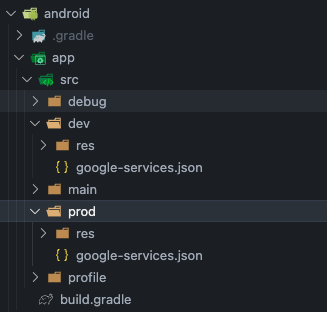

# Getx Ultimate Template Flavor Configuration

The Getx Ultimate Template incorporates two distinct flavors to manage different environments for both Android and iOS platforms: `development` and `production`. The `development` flavor is tailored for development purposes, facilitating testing and debugging. Conversely, the `production` flavor is optimized for deployment in production environments, ensuring stability and performance.

## Managing Project Flavors: `prod` and `dev`

This project leverages two specific flavors, `prod` and `dev`, to enhance the development and production workflows. These flavors enable the segregation of configurations and resources, allowing for precise management of environment-specific settings, APIs, and other essential parameters.

### Configuration

#### Android

For Android, the flavor configurations are specified within the `build.gradle` file located in the `android/app` directory. Each flavor is capable of defining its own application ID, version name, version code, and additional Android-specific settings.

```gradle
android {
    ...
    flavorDimensions "default"
    productFlavors {
        dev {
            dimension "default"
            applicationIdSuffix ".dev"
            versionNameSuffix "-dev"
        }
        prod {
            dimension "default"
        }
    }
}
```

#### iOS

On the iOS side, flavors are managed through Xcode configurations. It's possible to create distinct configurations for `dev` and `prod` by setup custom schemes.

1. fire up Xcode and open ios/Runner.xcworkspace
2. Click on Runner then select Runner under Project then add your expected flavors with their corresponding Debug, Profile and Release Configurations...


3. Click on the runner on the top part of code and create schemes for the flavors, in our case we'll create for dev and prod.


4. Match the Schemes to their corresponding Runners, in our case we'll edit the dev scheme.


5. Matching the target main.dart file to their corresponding scheme.


### Usage

#### Running Flavors

To execute a specific flavor, the following commands can be utilized:

To run the `development` flavor, execute:

```shell
flutter run --flavor dev
```

To run the `production` flavor, execute:

```shell
flutter run --flavor prod
```

#### Firebase Configuration 

To configure Firebase for each flavor, follow the steps below:

1. Create a new Firebase project for each flavor (e.g., `dev` and `prod`).
2. Download the `google-services.json` file for each Firebase project.

#### For Android:

Drop the `google-services.json` file in the corresponding flavor directory located in `android/app/src/`.



#### For iOS:

First, Drop the `GoogleService-Info.plist` file in the corresponding flavor directory


Then, click on Runners under Targets and click on Build phases create a new phase, we'll name ours Copy Google Plist file. and move it right under "Run script"


Then add the following script to the newly created phase:

```shell
# Type a script or drag a script file from your workspace to insert its path.
PATH_TO_GOOGLE_PLISTS="${PROJECT_DIR}/Config"

echo "build config is ${CONFIGURATION}"

case "${CONFIGURATION}" in

    "dev-Debug" | "dev-Profile" | "dev-Release")
        cp -r "$PATH_TO_GOOGLE_PLISTS/dev/GoogleService-Info.plist" "${BUILT_PRODUCTS_DIR}/${PRODUCT_NAME}.app/GoogleService-Info.plist" ;;
    "prod-Debug" | "prod-Profile" | "prod-Release")
        cp -r "$PATH_TO_GOOGLE_PLISTS/prod/GoogleService-Info.plist" "${BUILT_PRODUCTS_DIR}/${PRODUCT_NAME}.app/GoogleService-Info.plist" ;;
    *)
        ;;
esac
```